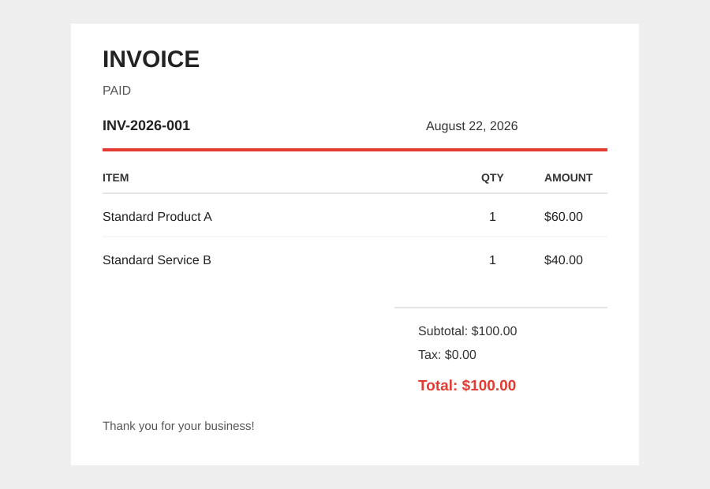

# PDF to JSON Invoice Parser

This command-line tool reads a text-based invoice PDF and creates a readable
JSON file containing the invoice number, date, products, prices, totals, and
the original extracted text.

## Requirements

- Python 3.10 or newer
- A text-based PDF invoice

Scanned or image-only PDFs need OCR before this tool can extract their text.

## Installation

Open PowerShell or a terminal in this project folder and run:

```bash
pip install pypdf
```

## Convert a PDF

Save the PDF inside the `file` folder, then run:

```bash
python pdf_to_json.py file/invoice.pdf --output invoice.json
```

The `--output` option is optional. Without it, the tool creates a timestamped
file next to the input PDF, such as `file/invoice_20260822_140601.json`, and
prints the JSON in the terminal:
The `--output` option is optional. Without it, the tool creates an `output`
folder and saves a timestamped file there, such as
`output/invoice_20260822_140601.json`. It also prints the JSON in the terminal:

```bash
python pdf_to_json.py file/invoice.pdf
```

Windows paths can also be written with forward slashes:

```bash
python pdf_to_json.py "C:/Documents/my-invoice.pdf" --output my-invoice.json
```

## Example Output

Sample invoice preview:



The values visible in the invoice are converted into the matching JSON
fields below:

```json
{
	"success": true,
	"file_path": "file/invoice.pdf",
	"generated_at": "2026-08-22T14:06:01+05:30",
	"invoice": {
		"invoice_number": "INV-2026-001",
		"date": "August 22, 2026",
		"products": [
			{
				"item": "Standard Product A",
				"quantity": 1,
				"price": 60.0
			},
			{
				"item": "Standard Service B",
				"quantity": 1,
				"price": 40.0
			}
		],
		"subtotal": 100.0,
		"tax": 0.0,
		"total": 100.0
	},
	"text": "The text extracted from the PDF..."
}
```

## Error Output

If the file does not exist or cannot be read, the tool returns JSON with
`success` set to `false`:

```json
{
	"success": false,
	"file_path": "file/missing.pdf",
	"error": "PDF file not found: file/missing.pdf"
}
```

## Supported Invoice Format

The parser looks for these labels and table columns:

- Invoice number, such as `INV-2026-001`
- Date, such as `Date: August 22, 2026`
- Product rows containing item name, quantity, and dollar amount
- `Subtotal`, `Tax (0%)`, and `Total Amount`

Invoice layouts that use different labels may require changes to the parsing
patterns in `pdf_to_json.py`.
